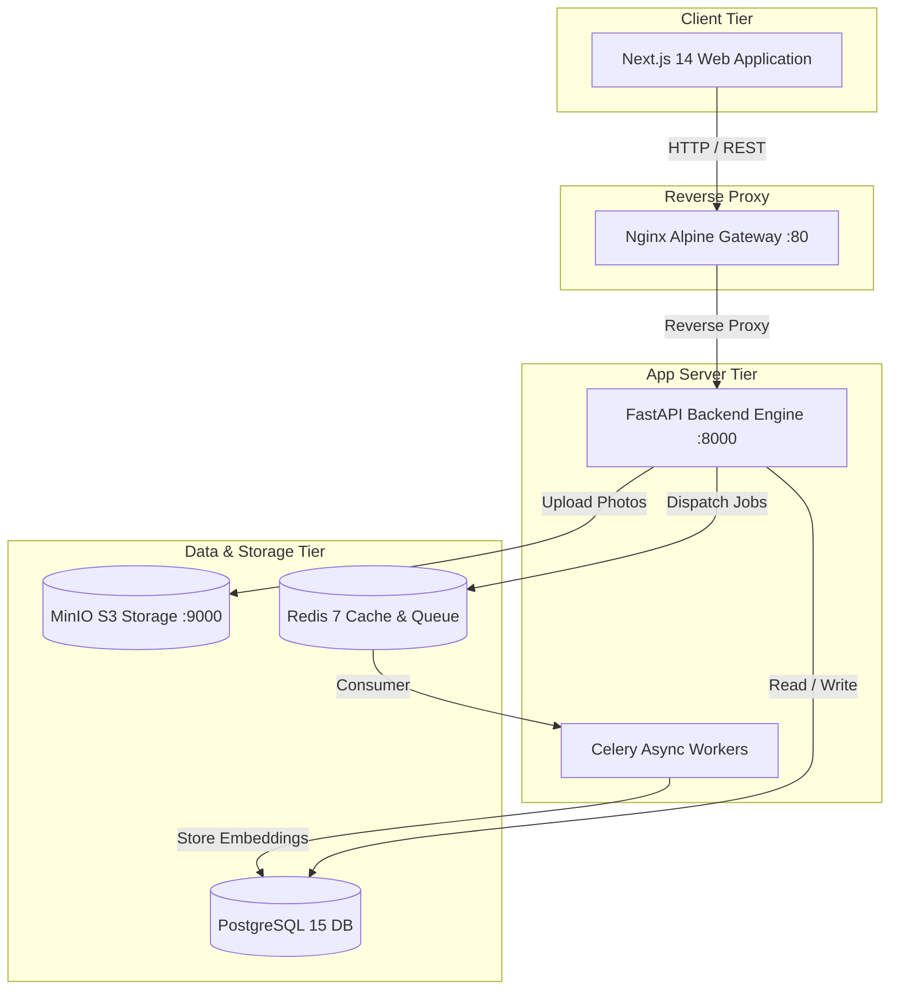

<div align="center">

# 🇵🇰 WAJOOD (وجود)
### Pakistan's Unified AI-Powered Missing Persons & Unidentified Bodies Platform
*Nationwide Digital Reunification Telemetry & Biometric Matching Network*

[](https://nextjs.org/)
[](https://fastapi.tiangolo.com/)
[](https://www.postgresql.org/)
[](https://docs.celeryq.dev/)
[](https://www.docker.com/)
[](https://github.com/junaidahmeddev/wajood)

---

> **"ہر گمشدہ کی امید، ہر بے نام کا پتا"**  
> *"Hope for the Missing, Identity for the Unnamed."*

</div>

---

## 🌟 Executive Summary

In Pakistan, thousands of individuals go missing annually due to urban displacement, mental health crises, child abduction, and natural disasters. The national response has historically been fragmented across siloed NGO registries (Edhi, Chhipa), disconnected police stations (FIRs), hospital emergency wards, and municipal morgues. 

**WAJOOD** unifies these disparate entities into a single, cohesive digital ecosystem. Powered by **asynchronous AI facial recognition**, real-time geospatial telemetry, and role-based operational command dashboards, WAJOOD bridges the gap between first responders, medical examiners, law enforcement agencies, and grieving families.

---

## 🏛️ The 9 Unified Operational Portals

WAJOOD provides dedicated, tailored workspaces for every real-world stakeholder in Pakistan’s missing persons pipeline:

| Portal | Role & Target Stakeholder | Primary Capabilities |
| :--- | :--- | :--- |
| 🧑‍🤝‍🧑 **Public Citizen** | General Public & Grieving Families | Clean intake form, bilingual status badges (`گمشدہ Missing`), FIR linking, public case tracking timeline. |
| 🏠 **NGO & Shelter** | Edhi Foundation, Chhipa, Saylani | Found person registration, automated AI face matching against national missing index, instant reunification alerts. |
| 👮 **Law Enforcement** | Police Stations, FIA Cybercrime | Biometric Match Queue verification, official FIR linking, high-priority case escalation, national search telemetry. |
| 🏥 **Hospital Emergency** | ER Doctors, Medical Social Workers | Unidentified patient admission (`UNIDENTIFIED`), automated facial scan upon triage, patient status updating. |
| 🗺️ **Volunteer Network**| Community Search Groups, Scouts | Interactive Leaflet radius search maps, live sighting reports, neighborhood flyer generation. |
| 📺 **Media & Broadcast**| News Channels (ARY, Geo), Journalists | Anonymized case data feeds, press kit packaging (`wajood_media_kit.zip`), awareness graphic generators. |
| 🏛️ **Government NDMA**| Provincial & National Disaster Authorities | Disaster event selection (e.g., *Sindh Floods*), bulk CSV mass intake, national overview graphs. |
| 🔬 **Forensics & Morgue**| PFSA Forensic Technicians, Mortuaries | Deceased cold storage intake (`DECEASED`), DNA sample reference tagging, post-mortem identification reports. |
| ⚙️ **System Admin** | Ministry & Platform Architects | Global RBAC control, immutable cryptographic audit logs, nationwide recovery rate analytics. |

---

## 🧠 Core Architectural Innovations

### 1. Asynchronous AI Biometric Matching Pipeline
When an unidentified found person or deceased body is registered, the image is passed into an asynchronous Celery worker queue backed by Redis. The AI engine extracts 128-d facial embeddings and computes cosine similarity against all active missing cases. Matches exceeding the **85% confidence threshold** automatically generate high-priority cross-portal notifications.

### 2. Full Bilingual Localization (English + Urdu)
Designed for accessibility across all socio-economic strata in Pakistan, all case status indicators render bilingually:
*   🟡 `گمشدہ Missing`
*   🟢 `زندہ ملا Found Alive`
*   ⚫ `وفات Deceased`
*   🔵 `میچ ہوا Matched`
*   🟣 `زیر تفتیش In Process`

### 3. Network-Resilient Demo Mode
To ensure uninterrupted presentation and panel evaluation, the frontend Axios API layer features intelligent interceptors. If local database containers or cloud backend instances experience cold starts, the platform instantly transitions to serving rich, localized Pakistani fallback datasets (cases from *Karachi, Lahore, Islamabad*).

---

## 🏗️ System Architecture



---

## 🚀 Instant Local Installation (Docker)

WAJOOD is fully containerized. You can launch the entire nationwide telemetry cluster on any Windows, macOS, or Linux machine with a single command:

### Prerequisites
*   [Docker Desktop](https://www.docker.com/products/docker-desktop/) installed and running.
*   Git CLI.

### Step-by-Step Setup

1. **Clone the Repository**
   ```bash
   git clone https://github.com/junaidahmeddev/wajood.git
   cd wajood
   ```

2. **Launch the Container Stack**
   ```bash
   docker-compose up -d --build
   ```

3. **Access the Portals**
   *   👉 **Unified Web Platform**: `http://localhost:3000`
   *   👉 **FastAPI Interactive Docs**: `http://localhost:8000/docs`
   *   👉 **MinIO S3 Console**: `http://localhost:9001` *(User: `wajood` | Pass: `wajood123`)*

> **Note on FYP Demo Mode**: Authentication barriers have been bypassed by default. Clicking any portal card on the home screen immediately enters the designated role with simulated user sessions.

---

## ☁️ Cloud Deployment Guide

### Frontend Deployment (Vercel)
1. Import the repository into [Vercel](https://vercel.com/).
2. Set the **Root Directory** to `frontend`.
3. Add the environment variable:
   ```env
   NEXT_PUBLIC_API_URL=https://your-render-backend.onrender.com
   ```
4. Click **Deploy**. Vercel will automatically detect `vercel.json` and build 17 static pages with zero compilation errors.

### Backend Deployment (Render / Railway)
1. Create a new Web Service pointing to the root `backend` folder.
2. Select the Docker runtime or Python 3.11 environment.
3. Attach a managed PostgreSQL database and Redis instance.

---

## 🛠️ Technology Stack

*   **Frontend**: Next.js 14 (App Router), React 18, Tailwind CSS, Recharts, Lucide Icons, React Hook Form, Zod.
*   **Backend**: Python 3.11, FastAPI, SQLAlchemy (AsyncIO), Pydantic v2, Passlib, PyJWT.
*   **AI / Vision**: OpenCV, DeepFace / Face Recognition Embeddings, NumPy, Scikit-Learn.
*   **DevOps**: Docker, Docker Compose, Nginx Reverse Proxy, MinIO Object Storage, Celery, Redis.

---

## 🎓 Academic Acknowledgment

**WAJOOD** was conceived, designed, and engineered as a Major Final Year Capstone Project (FYP) for the Department of Software Engineering, **Sir Syed University of Engineering and Technology (SSUET), Karachi — Class of 2026**.

*Dedicated to Edhi Foundation, Chhipa Welfare Association, and all brave search and rescue workers serving humanity across Pakistan.*

---

<div align="center">
  <p>Released under the MIT License.</p>
  <p>Made with ❤️ for Pakistan 🇵🇰</p>
</div>
